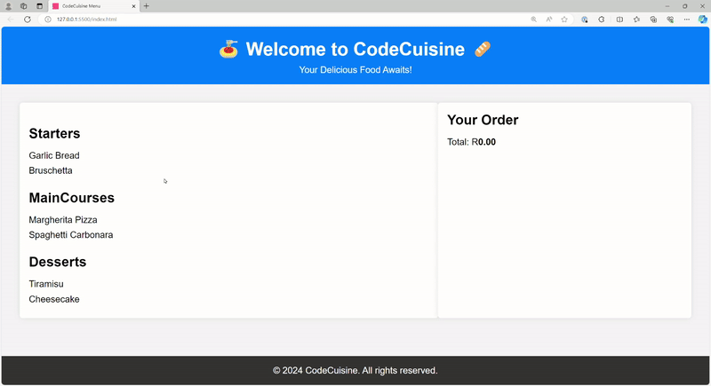

# [JSL06] Submission: CodeCuisine Menu Display System Challenge

You will:
1. Use the provided Starter Code Repository: https://github.com/CodeSpace-Academy/Module_6_StudentNo_Classcode_Group_Name-Surname_JSL06
2. Code your solution.
3. Commit changes to your GitHub repository.
4. Submit the GitHub Repository Link to the LMS [JSL06] Submission Project Tab.

In this coding challenge, you will build a simple menu display system for a fictional UberEats restaurant called "CodeCuisine." The goal is to display different categories of food items and allow users to add items to their order with a click. This challenge will help you apply various JavaScript concepts, including functions, closures, and event handling, to create an interactive menu.

## Objectives:

- Create and use functions to dynamically populate the menu items on the page.
- Implement a callback function to handle adding items to the order.
- Use closures to maintain the state of the order.
- Utilize function expressions and anonymous functions.
- Call built-in functions and create custom functions to manage the menu and order system.

## Instructions:

1. **Use the Project Files:** Begin by accessing the starter code in the JSL06 GitHub repo.

2. **JavaScript Implementation**: Use the provided starter code in `index.js` as a foundation for your application. The starter code contains placeholders for key functions and comments to guide you through the implementation.

    - `menu`: The `menu` object contains sample menu data, including categories and items. You can expand this menu with more items if needed.

    - `displayMenuItems(menu)`: This function should dynamically create and display menu items grouped by category. Iterate over the `menu` object and create HTML elements for each category and item. Attach event listeners to the menu items to handle adding items to the order.

    - `addToOrder(itemName)`: Implement this callback function to update the order summary when an item is added. You can use closures to maintain the state of the order. Calculate and update the total price accordingly.

    - `initMenuSystem(menu)`: Call the `displayMenuItems` function with the menu data and attach event listeners to menu items.

3. **Testing**: Thoroughly test your application to ensure that it can correctly add items to the order and that the order total updates as expected.

## What You Need to Do:

To complete this challenge, follow these steps:

1. Clone the provided Starter Code Repository to your local development environment: [Starter Code Repository](https://github.com/CodeSpace-Academy/Module_6_StudentNo_Classcode_Group_Name-Surname_JSL06).
2. Open the cloned project in your code editor.
3. Code your solution following the provided instructions and comments in the starter code.
4. Commit your changes to your local Git repository with meaningful commit messages.
5. Push your local Git repository to your GitHub account.
6. Verify that the changes have been successfully pushed to your GitHub repository.

## What You Need to Include:

1. Ensure that your code includes the necessary modifications to meet the challenge requirements.
2. Your GitHub repository should contain the updated code files.

## How We'll Assess Your Work:

1. We will review your GitHub repository to ensure that it contains the updated code files.
2. We will assess the modifications made to the code to verify that they effectively meet the challenge requirements.
3. We will consider the commit history and meaningful commit messages to evaluate your coding process.

By following these steps and completing the challenge, you will demonstrate your ability to create interactive web applications using JavaScript. Good luck, and enjoy building the CodeCuisine Menu Display System!
